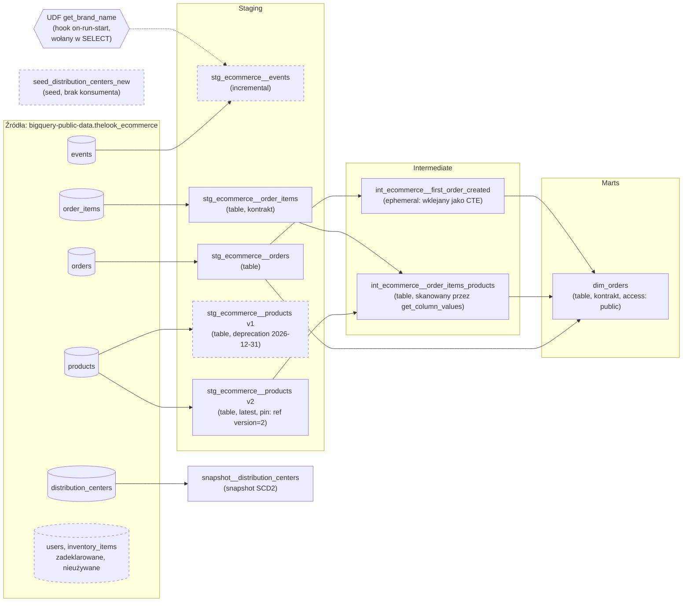

# dbt na BigQuery — analityka e-commerce

Projekt dbt Core zbudowany na bazie projektu szkoleniowego i rozszerzony o własne dodatki.
Źródło danych: `bigquery-public-data.thelook_ecommerce` (publiczny dataset BigQuery).

## Struktura

```
models/
  staging/       # stg_ecommerce__* — jeden model na tabelę źródłową
  intermediate/   # int_ecommerce__* — joiny i agregacje pośrednie
  marts/          # dim_orders — finalna tabela biznesowa
seeds/            # dane z CSV
snapshots/        # SCD2 dla distribution_centers
tests/            # testy singular i generic (m.in. własny test primary_key)
macros/           # makra Jinja, w tym UDF-y tworzone przez hook on-run-start
analyses/         # zapytania eksploracyjne (dbt compile, bez materializacji)
```

## Lineage (DAG)

Co z czym łączy się przez `source()` i `ref()`. Krawędzie wygenerowane z `target/manifest.json`. W nawiasie materializacja.



Linia przerywana w ramce oznacza ślepą uliczkę: obiekt się buduje, ale nic go nie czyta. `stg_ecommerce__events` i UDF działają obok gałęzi `dim_orders`, bez wpływu na mart. Seed i snapshot są niezależne od modeli.

Podgląd gałęzi z terminala: `uv run dbt ls -s +dim_orders --profiles-dir .` (przodkowie martu) albo `-s stg_ecommerce__orders+` (wszystko, co zależy od modelu).

## Komendy dbt

Komendy odpalane z katalogu repo, z prefiksem `uv run` (albo bez niego w aktywnym `.venv`). Flaga `--profiles-dir .` nie jest potrzebna: dbt najpierw szuka `profiles.yml` w bieżącym katalogu.

### Podstawowe komendy

| Komenda | Co robi | Na tabelach tego projektu | Baza? |
|---|---|---|---|
| `dbt debug` | Sprawdza profil, zmienne i połączenie | czy `BIGQUERY_KEYFILE` i `BIGQUERY_PROJECT` są poprawne | tak |
| `dbt deps` | Instaluje pakiety z `packages.yml` do `dbt_packages/` | `dbt_utils`, `dbt_expectations` | nie |
| `dbt parse` | Buduje graf i waliduje YAML, bez SQL-a | szybka kontrola składni; **nie** sprawdza kolumn `total_sold_*` w `dim_orders` | nie |
| `dbt ls -s +dim_orders` | Wypisuje węzły pasujące do selektora | 6 modeli, od których zależy `dim_orders` | nie |
| `dbt compile -s dim_orders` | Renderuje Jinja do czystego SQL w `target/compiled/` | widać wygenerowane kolumny per dział i wklejone CTE `first_order_created` | tak |
| `dbt show -s dim_orders --limit 10` | Wykonuje SELECT modelu i pokazuje wynik, bez zapisu tabeli | podgląd martu przed buildem | tak |
| `dbt seed` | Ładuje CSV z `seeds/` do tabel | `seed_distribution_centers_new` (2 wiersze) | tak |
| `dbt snapshot` | Porównuje źródło z historią i dopisuje zmiany (SCD2) | `snapshot__distribution_centers` w `snapshots_project` | tak |
| `dbt run -s stg_ecommerce__orders` | Buduje modele (tabele, widoki, incremental), **bez testów** | jedna tabela staging | tak |
| `dbt run -s stg_ecommerce__events --full-refresh` | Buduje incremental od zera, ignorując istniejący stan | po zmianie logiki filtra albo kolumn eventów | tak |
| `dbt test -s stg_ecommerce__orders` | Uruchamia testy na zbudowanych tabelach | 17 testów, w tym `relationships` z innych modeli wskazujące na zamówienia | tak |
| `dbt build -s +dim_orders` | seed + snapshot + run + test w kolejności DAG-a, testy **zaraz po** każdym modelu | cała gałąź martu; nieudany test `error` zatrzymuje modele zależne | tak |
| `dbt source freshness` | Sprawdza świeżość źródeł (`error_after`) | tylko `events` ma zdefiniowaną świeżość; kod wyjścia 1 = dane za stare | tak |
| `dbt retry` | Powtarza tylko węzły, które padły w ostatnim przebiegu | po awarii nie trzeba budować wszystkiego od nowa | tak |
| `dbt docs generate` + `dbt docs serve` | Buduje i serwuje dokumentację z lineage i opisami | opisy z `.yml` i `doc('status')` w przeglądarce | tak (katalog) |
| `dbt run-operation generate_base_model --args '{...}'` | Wywołuje makro ręcznie | szkielet nowego modelu staging dla tabeli źródłowej | tak |
| `dbt clean` | Usuwa `target/` i `dbt_packages/` | reset artefaktów po dziwnych błędach kompilacji | nie |

### Selektory (`-s`)

| Zapis | Znaczenie | Przykład z tego projektu |
|---|---|---|
| `model` | tylko ten węzeł | `-s dim_orders` |
| `+model` | węzeł i wszystko, od czego zależy | `-s +dim_orders` - staging, intermediate, mart |
| `model+` | węzeł i wszystko, co od niego zależy | `-s stg_ecommerce__orders+` - zamówienia, `first_order_created`, `dim_orders` |
| `path:...` | wszystko w folderze | `-s path:models/staging` |
| `--exclude` | wyklucza węzły | `-s path:models/staging --exclude stg_ecommerce__events` |

### Kolejność pracy

**Dlaczego `build`, a nie `run` + `test`:** `dbt run` buduje wszystko, a dopiero potem `dbt test` sprawdza dane. Zły klucz w `stg_ecommerce__orders` trafia wtedy do `dim_orders`, zanim ktokolwiek to zauważy. `dbt build` testuje każdy model zaraz po zbudowaniu, a test na `error` zatrzymuje modele zależne.

**Zmiana modelu w dev** (np. edycja `int_ecommerce__order_items_products`):
1. `dbt parse` - czy YAML i graf są poprawne (sekundy, bez bazy).
2. `dbt compile -s int_ecommerce__order_items_products` - czy SQL wygląda tak, jak zakładasz.
3. `dbt show -s int_ecommerce__order_items_products --limit 10` - czy wynik ma sens.
4. `dbt build -s int_ecommerce__order_items_products+` - buduje model **i** `dim_orders` z testami. Model zależny też, bo kontrakt `dim_orders` wykryje zmianę kolumn dopiero przy jego budowie.

**Zmiana w `stg_ecommerce__events`** (model incremental):
1. `dbt build -s stg_ecommerce__events` - ścieżka incremental (MERGE ostatnich dni).
2. Zmiana logiki filtra albo usunięcie kolumny wymaga `--full-refresh`: `append_new_columns` nie usunie starej kolumny, a nowa logika nie przeliczy się na historii.

**Przed commitem / PR:**
1. `dbt build` na dev (całość albo `-s <zmieniony_model>+`). Zielony `dbt parse` nie wystarcza, bo nie widzi kolumn generowanych z danych.

**Przebieg produkcyjny** (orkiestracja, `--target prod`):
1. `dbt deps`
2. `dbt source freshness --target prod` - kod wyjścia 1 = stop, nie budujemy na starych danych.
3. `dbt build --target prod` - seed, snapshot, modele i testy w jednym przebiegu.
4. Po awarii: `dbt retry --target prod`.

## Setup

Wymagane narzędzia: [gcloud CLI](https://cloud.google.com/sdk/docs/install) (krok 1) i [uv](https://docs.astral.sh/uv/) (`brew install uv`, krok 2). Pythona nie trzeba instalować osobno - uv pobierze wersję z `.python-version`.

Autoryzacja przez **konto serwisowe** (service account) — nie przez lokalny OAuth (`gcloud auth application-default login`). OAuth loguje CIEBIE i działa tylko na maszynie, na której go odpaliłeś; konto serwisowe to tożsamość samego projektu, przenośna (CI/CD, inny laptop, kontener) i taka, której uprawnienia widać jawnie w IAM, a nie w czyjejś sesji logowania.

### 1. GCP — projekt i konto serwisowe

```bash
# Nowy projekt GCP (pomiń, jeśli używasz istniejącego)
gcloud projects create TWOJ_PROJECT_ID --name="dbt BigQuery"
gcloud config set project TWOJ_PROJECT_ID

# BigQuery API musi być włączone w projekcie, zanim dbt się z nim połączy
gcloud services enable bigquery.googleapis.com

# Konto serwisowe dedykowane pod dbt (nie Twoje osobiste konto Google)
gcloud iam service-accounts create dbt-bigquery \
  --display-name="dbt BigQuery"

# Rola dataEditor: tworzenie/nadpisywanie/kasowanie tabel i widoków w datasetach projektu
# (dbt run/build robi to non-stop — bez tej roli każdy build padnie na permission denied)
gcloud projects add-iam-policy-binding TWOJ_PROJECT_ID \
  --member="serviceAccount:dbt-bigquery@TWOJ_PROJECT_ID.iam.gserviceaccount.com" \
  --role="roles/bigquery.dataEditor"

# Rola jobUser: uruchamianie zapytań (query jobs) rozliczanych na ten projekt
# (dataEditor sam w sobie NIE pozwala odpalać zapytań - to świadomie rozdzielone uprawnienie)
gcloud projects add-iam-policy-binding TWOJ_PROJECT_ID \
  --member="serviceAccount:dbt-bigquery@TWOJ_PROJECT_ID.iam.gserviceaccount.com" \
  --role="roles/bigquery.jobUser"

# Klucz JSON - POZA folderem tego repo (np. ~/.gcp/), żeby żaden przyszły `git add -A`
# nie mógł go złapać niezależnie od .gitignore
mkdir -p ~/.gcp
gcloud iam service-accounts keys create ~/.gcp/dbt-bigquery.json \
  --iam-account=dbt-bigquery@TWOJ_PROJECT_ID.iam.gserviceaccount.com
```

Dataset źródłowy `bigquery-public-data.thelook_ecommerce` jest publiczny — Google nadaje odczyt każdej uwierzytelnionej tożsamości GCP, więc powyższe role nic tam nie zmieniają i nic dodatkowego nie trzeba nadawać. Zapytania są tanie (mały dataset, w granicach darmowego 1 TB/miesiąc), ale rozliczane na `TWOJ_PROJECT_ID`, nie na `bigquery-public-data`.

### 2. Repo i środowisko Python

```bash
git clone https://github.com/pmackowka/dbt-bigquery.git
cd dbt-bigquery

uv sync                       # tworzy .venv DOKŁADNIE według uv.lock (w razie potrzeby pobiera też Pythona 3.11)
source .venv/bin/activate     # Windows: .venv\Scripts\activate - albo bez aktywacji: uv run dbt ...
```

Za odtwarzalność środowiska odpowiadają trzy pliki:

| Plik | Kto go pisze | Co zawiera |
|---|---|---|
| `pyproject.toml` | ręcznie | zależności bezpośrednie (tylko adapter `dbt-bigquery`) |
| `uv.lock` | `uv lock` / `uv add` | całe drzewo zależności: dokładne wersje + hashe plików |
| `.python-version` | ręcznie | wersja interpretera (3.11) |

Samo przypięcie adaptera nie wystarcza: dbt-core i kilkadziesiąt pakietów pod nim idą zakresami, więc dwie instalacje w odstępie miesięcy dają różne środowiska (w tym repo: dbt-core 1.12.4 → 1.12.5 bez żadnej zmiany w kodzie). Pakiety dbt mają swój lock (`package-lock.yml`), a `uv.lock` domyka tę samą lukę warstwę niżej. Nową zależność dodaje się przez `uv add <pakiet>`, a nie `pip install`: `uv sync` usuwa wszystko, czego nie ma w locku.

### 3. Konfiguracja połączenia

```bash
cp profiles.yml.example profiles.yml   # profiles.yml jest w .gitignore - nigdy go nie commituj
export BIGQUERY_PROJECT="TWOJ_PROJECT_ID"
export BIGQUERY_KEYFILE="$HOME/.gcp/dbt-bigquery.json"

dbt deps --profiles-dir .    # instaluje pakiety z packages.yml do dbt_packages/
dbt debug --profiles-dir .   # weryfikuje połączenie PRZED pierwszym run - najczęstszy błąd
                              # na tym etapie to literówka w BIGQUERY_PROJECT albo zła ścieżka klucza
```

Target `prod` ma **osobne** zmienne (`BIGQUERY_PROD_PROJECT`, `BIGQUERY_PROD_KEYFILE`) i celowo nie spada na zmienne dev. Do pracy lokalnej nie są potrzebne — dbt renderuje tylko wybrany target. Żeby odpalić `--target prod`, trzeba mieć drugie konto serwisowe (najlepiej w osobnym projekcie GCP) utworzone tak samo jak w kroku 1; wtedy konto dev może dostać prawo zapisu wyłącznie do własnych datasetów `dbt_dev_*`, a przypadkowy `--target prod` na laptopie z samym kluczem dev pada na brakującej zmiennej, zamiast nadpisać prod. Uzasadnienie w komentarzu w `profiles.yml.example`.

### 4. Pierwszy build

```bash
dbt build --profiles-dir .               # seed + snapshot + run + test w kolejności DAG-a
dbt build --profiles-dir . -s +dim_orders   # albo tylko mart i wszystko, od czego zależy
```

`dbt build` sam ładuje seed i robi snapshot - osobne `dbt seed` / `dbt snapshot` nie są potrzebne. Pomija je tylko `dbt run`. Datasety (`dbt_dev_project`, `snapshots_project`) dbt zakłada sam przed hookiem `on-run-start`, więc UDF `get_brand_name` powstaje już przy pierwszym przebiegu.

Świeżości źródeł `dbt build` nie sprawdza. Żeby nie budować na starych danych, odpal najpierw `dbt source freshness --profiles-dir .` - kod wyjścia 1 (przekroczone `error_after`) oznacza: nie odpalaj builda.

## Notatki (prywatne, tylko dla mnie)

Pełne notatki merytoryczne z pracy nad tym projektem (setup, warstwy modeli, testy, kontrakty, snapshoty, Jinja/makra) są w moim prywatnym repo wiedzy: [dbt-Kompletny-Przewodnik-BigQuery.md](https://github.com/pmackowka/knowledge-base/blob/main/wiki/Software/dbt/dbt-Kompletny-Przewodnik-BigQuery.md).

Ten link **działa tylko na moim koncie GitHub** — repo jest prywatne i takie zostanie. Dla każdego innego zwraca 404, to celowe, nie błąd.
